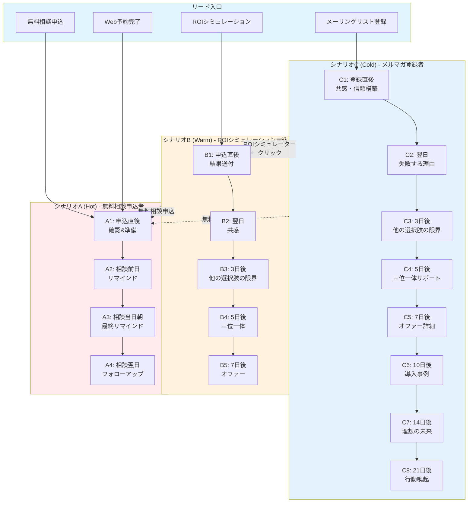
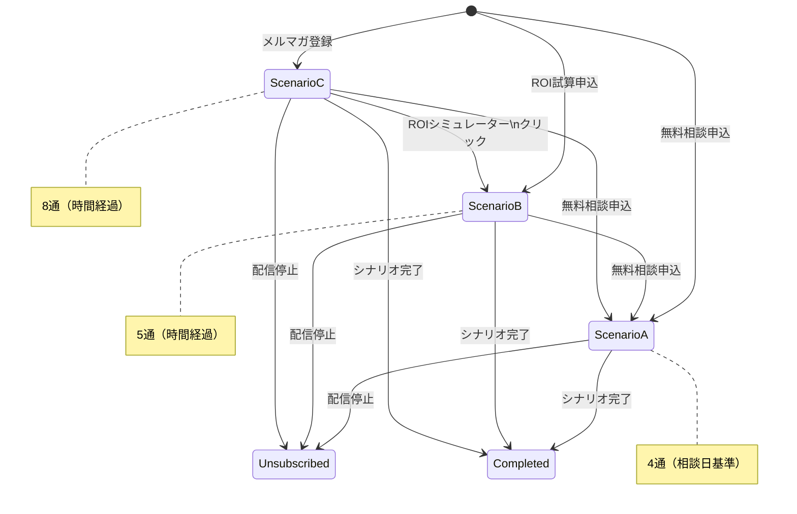
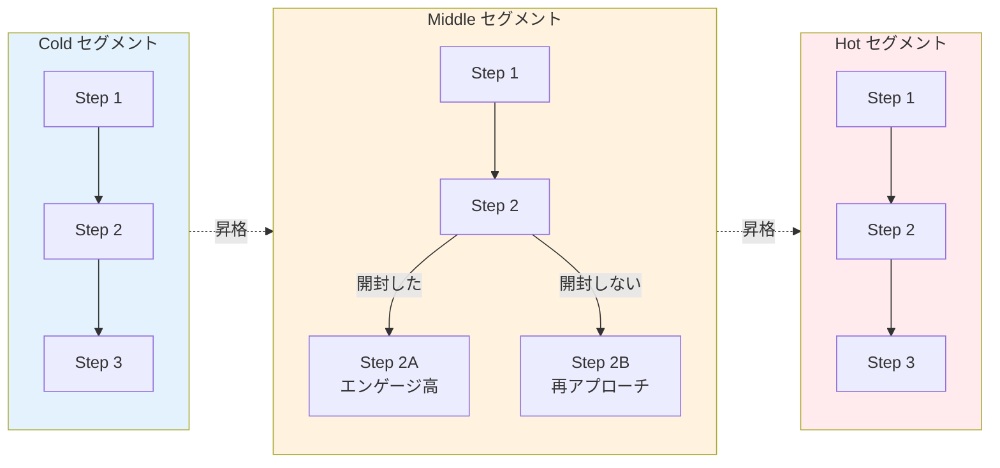
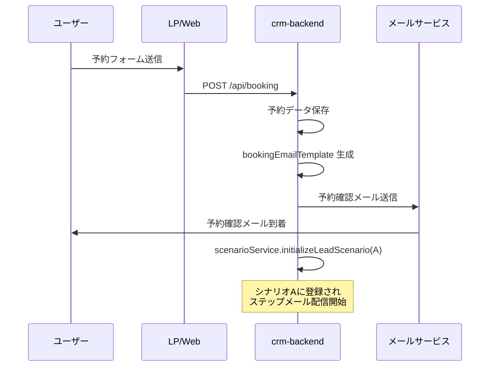
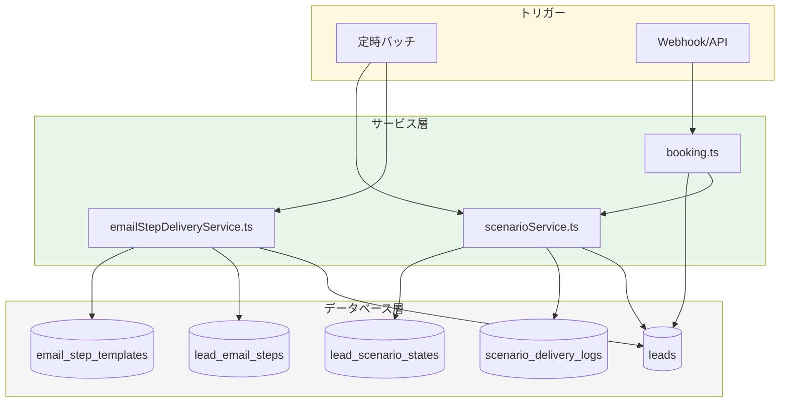

# メール配信フロー可視化ドキュメント

このドキュメントは、CRMシステムにおけるメール配信の全体像を可視化したものです。

## 配信システム概要

本システムには **3つの独立した配信メカニズム** が存在します。

| システム | 管理サービス | 用途 | トリガー |
|---------|-------------|------|----------|
| シナリオベース配信 | `scenarioService.ts` | A/B/Cシナリオ（温度感別ナーチャリング） | 時間経過 + 相談日基準 |
| セグメントベース配信 | `emailStepDeliveryService.ts` | Hot/Middle/Cold別ステップメール | 開封条件 + 時間経過 |
| 予約確認メール | `booking.ts` | 予約完了時の即座確認 | 予約完了イベント |

---

## 1. シナリオベース配信フロー

### 1.1 シナリオ遷移全体図

### 1.2 シナリオ詳細

#### シナリオA: 無料相談申込者向け（Hot）

| 通数 | タイミング | テーマ | 目的 |
|------|-----------|--------|------|
| A1 | 申込直後 | 確認&準備 | 商談のNo Show防止 |
| A2 | 相談前日 18:00 | リマインド&共感 | 期待値設定 |
| A3 | 相談当日 9:00 | 最終リマインド | 出席確認 |
| A4 | 相談翌日 10:00 | フォローアップ | 成約率UP |

**特徴**: 相談日基準で配信（`getLeadsForConsultationDelivery` で処理）

#### シナリオB: ROIシミュレーション申込者向け（Warm）

| 通数 | タイミング | テーマ | 目的 |
|------|-----------|--------|------|
| B1 | 申込直後 | 結果送付 | ROI結果の活用促進 |
| B2 | 24時間後 | 共感 | 数字→感情への橋渡し |
| B3 | 72時間後 | 他の選択肢の限界 | 差別化 |
| B4 | 120時間後 | 三位一体 | ソリューション説明 |
| B5 | 168時間後 | オファー | 相談への誘導 |

**特徴**: 申込からの経過時間で配信

#### シナリオC: メーリングリスト登録者向け（Cold）

| 通数 | タイミング | テーマ | 目的 |
|------|-----------|--------|------|
| C1 | 登録直後 | 共感・信頼構築 | ウェルカム |
| C2 | 24時間後 | 失敗する理由 | 問題提起 |
| C3 | 72時間後 | 他の選択肢の限界 | 差別化 |
| C4 | 120時間後 | 三位一体 | ソリューション説明 |
| C5 | 168時間後 | オファー詳細 | 具体的提案 |
| C6 | 240時間後 | 導入事例 | 社会的証明 |
| C7 | 336時間後 | 理想の未来 | ビジョン共有 |
| C8 | 504時間後 | 行動喚起 | CTA |

**特徴**: 最も長いシナリオ（教育が必要なため）

---

## 2. シナリオ遷移ルール

### 遷移時の処理

| イベント | 遷移元 | 遷移先 | 除外される配信 |
|---------|--------|--------|--------------|
| ROIシミュレータークリック | C | B | シナリオCから除外 |
| 無料相談申込 | B, C | A | シナリオB,Cから除外 |
| 配信停止 | A, B, C | null | 全シナリオから除外 |

---

## 3. セグメントベース配信フロー

シナリオベースとは別に、リードのセグメント（Hot/Middle/Cold）に基づく配信も存在します。

### セグメントベースの特徴

- **開封条件分岐**: 前のステップの開封有無で配信内容を変更
- **リード作成日基準**: `delay_days` で配信タイミングを制御
- **テンプレート管理**: `email_step_templates` テーブルで管理

---

## 4. 予約確認メール

予約完了時に即座に送信されるトランザクションメール。

---

## 5. システム間の関係図

---

## 6. 重要ファイル一覧

| ファイル | 役割 |
|---------|------|
| `crm-backend/src/services/scenarioService.ts` | シナリオ状態管理 |
| `crm-backend/src/services/scenarioDeliveryService.ts` | シナリオ配信実行 |
| `crm-backend/src/services/emailStepDeliveryService.ts` | セグメントベース配信 |
| `crm-backend/src/types/scenario.ts` | シナリオ定義 |
| `crm-backend/src/routes/booking.ts` | 予約処理 |
| `crm-backend/supabase/migrations/20260103_add_scenario_tables.sql` | DBスキーマ |

---

## 7. 運用上の注意点

### シナリオとセグメントの二重管理について

現在、以下の2つのシステムが並存しています：

1. **シナリオベース（A/B/C）**: 申込窓口に応じた温度感別のナーチャリング
2. **セグメントベース（Hot/Middle/Cold）**: エンゲージメントに基づく配信

**推奨**: 新規リードはシナリオベースで管理し、セグメントベースは既存リードの補完的配信に使用

### 配信停止時の挙動

- シナリオからの配信停止: `transitionScenario(leadId, 'unsubscribe')`
- 全メール配信停止: リードの `email_opt_in = false` に更新

---

*最終更新: 2026-01-11*
